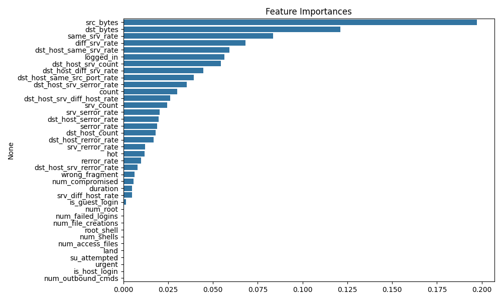
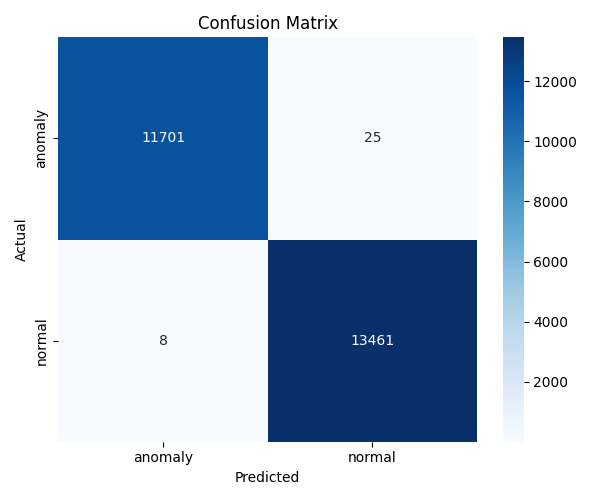

# AI-Powered Network Traffic Classifier

This project uses machine learning to classify network traffic and detect anomalies. It provides a Streamlit web UI for easy CSV upload, prediction, and result download.

## Features

- Upload your own CSV network traffic data
- Automated preprocessing and prediction
- Download results with predicted labels
- Visualize model feature importances and confusion matrix

## Getting Started

### 1. Clone the repository

```bash
git clone https://github.com/yourusername/your-repo.git
cd your-repo
```

### 2. Install requirements

```bash
pip install -r requirements.txt
```

### 3. Train the model

Make sure your dataset is in `dataset/train1.csv`, then run:

```bash
python train.py
```

This will save the trained model and graphs in the `model/` directory.

### 4. Run the Streamlit app

```bash
streamlit run app.py
```

## Usage

- Open the Streamlit app in your browser.
- Upload a CSV file with the same features as the training data.
- View predictions and download the results.

## Model Performance & Visualizations

### Feature Importances



### Confusion Matrix



---

**Note:**  
- Ensure your CSV columns match the training features.
- The model and graphs are generated after running `train.py`.

## Requirements

- Python 3.8+
- See `requirements.txt` for Python package dependencies.

## License

MIT License

## Authors
Baibhav Kumar
Hetav Desai
